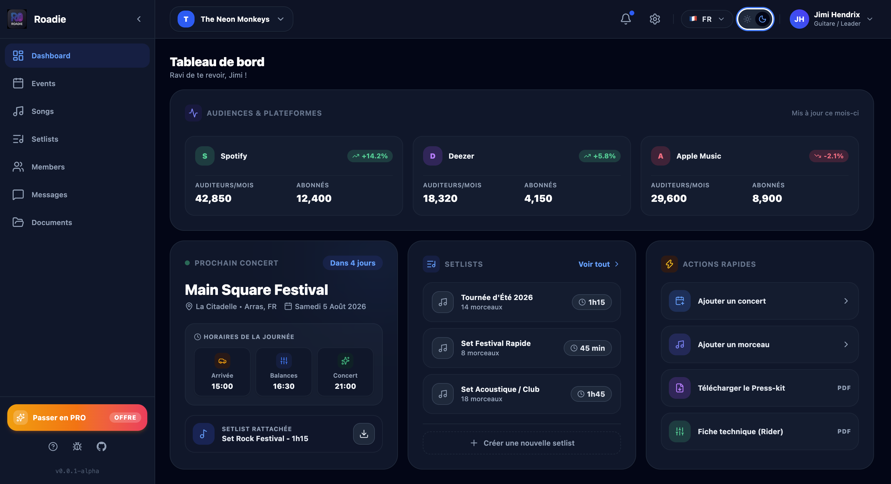
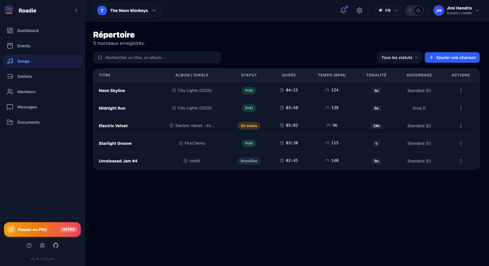
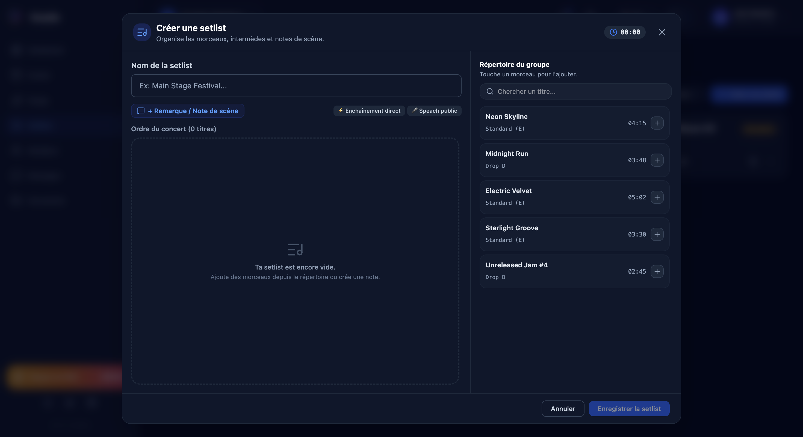

# Roadie

  
  
  
  

---

Roadie is a comprehensive management platform designed for the modern music industry. It centralizes operations for artists, bands, orchestras, labels, and bookers into a single, cohesive ecosystem. From live performance preparations and repertoire tracking to technical documentation and streaming analytics, Roadie streamlines workflow logistics to eliminate operational friction.

---

## Table of Contents

- [Overview](#overview)
- [Module Availability](#module-availability)
- [Key Features](#key-features)
  - [Artist & Band Platform](#artist--band-platform)
  - [Upcoming Modules](#upcoming-modules)
- [Tech Stack](#tech-stack)
- [Getting Started](#getting-started)
  - [Prerequisites](#prerequisites)
  - [Installation](#installation)
- [Project Architecture](#project-architecture)
- [License](#license)

---

## Overview

Managing music operations often requires juggling fragmented tools for setlist creation, technical riders, scheduling, team communications, and performance tracking. Roadie solves this by providing a unified environment with dedicated interfaces for each key player in the music industry ecosystem.

---

## Module Availability

| Module | Status | Description |
| :--- | :--- | :--- |
| **Artist / Band Platform** | Active | Complete suite for musicians, solo artists, bands, and orchestras. |
| **Label Platform** | In Development | Roster oversight, release calendars, and catalog administration. |
| **Booker Platform** | In Development | Booking pipelines, venue databases, and deal memo tracking. |

---

## Key Features

### Artist & Band Platform

#### Entity & Project Management
- **Flexible Project Configuration**: Support for solo projects, full bands, side projects, and orchestras.
- **Role-Based Governance**: Fine-grained permission control for musicians, band leaders, tech crew, and managers.

#### Interactive Setlists & Live Stage Tools
- **Drag & Drop Ordering**: Reorder tracks dynamically for rehearsals and live performances.
- **Real-Time Duration Calculator**: Automated set duration computation updated on every modification.
- **Tuning & Instrument Change Detection**: Automatic visual warnings when adjacent tracks require instrument or tuning adjustments (e.g., Standard E to Drop D).
- **Stage Notes & Annotations**: Insert custom speech prompts, cues, intermudes, or transition markers between tracks.
- **Stage-Ready PDF Export**: One-click generation of high-contrast printable setlists designed for stage use.

#### Repertoire & MusicBrainz Integration
- **Track & Album Management**: Complete catalog tracking including durations, key signatures, BPM, and custom tunings.
- **MusicBrainz Auto-Sync**: Automated metadata synchronization with global MusicBrainz databases.

#### Events & Logistics
- **Event Lifecycle Management**: Schedule, update, and manage rehearsals, residencies, single gigs, and full tours.
- **Automated Notifications**: Automated alerts and reminders delivered via Email and Discord webhooks.

#### Press Kits & Technical Riders
- **EPK Generator**: Create professional Electronic Press Kits with media assets, bio, and performance histories.
- **Technical Riders & Stage Plans**: Centralized storage and distribution of technical requirements, channel lists, and stage setups.

#### Direct Communication & Analytics
- **Project Chat**: Built-in messaging system for real-time collaboration among project members.
- **Streaming Analytics**: Automatic retrieval and aggregation of performance metrics from major streaming platforms.
- **Optimized Dashboard**: High-level visual dashboard summarizing upcoming events, metric trends, and recent activity.

### Upcoming Modules

#### Label Management Platform *(In Active Development)*
- Centralized roster supervision across multiple artist entities.
- Release schedule orchestration and distribution tracking.

#### Booker Platform *(In Active Development)*
- Venue contact databases, tour routing tools, and deal memo management.

---

## Tech Stack

- **Frontend**: React, TypeScript
- **Styling**: Tailwind CSS
- **Icons**: Lucide React
- **Build Tool**: Vite
- **Integrations**: MusicBrainz API, Discord Webhooks, Streaming APIs